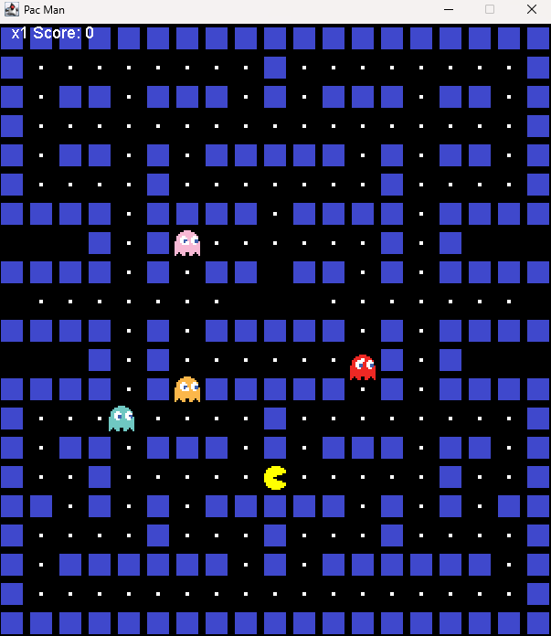

# 🟡 Pac-Man Java Clone

A modern, object-oriented clone of the classic Pac-Man arcade game, fully built with Java and Swing. Includes animated ghosts, dynamic food collection, score tracking, and life management.  

# 🎮 Features

-Smooth movement and directional controls
-Functional ghost AI with randomized movement
-Food collection and score tracking
-Life system with game over logic
-Simple reset and replay functionality
-Map built using a tile-based system
-Customizable level layout with easily editable ASCII map

🧰 Getting Started
1. Clone the repository
   
   -git clone https://github.com/yourusername/pacman.git
   
   -cd pacman-java
3. Add required image assets
   
      -Place all image files in the same directory as PacMan.java
   
5. Compile and run the game
6. 
   -javac PacMan.java
   
   -java PacMan

